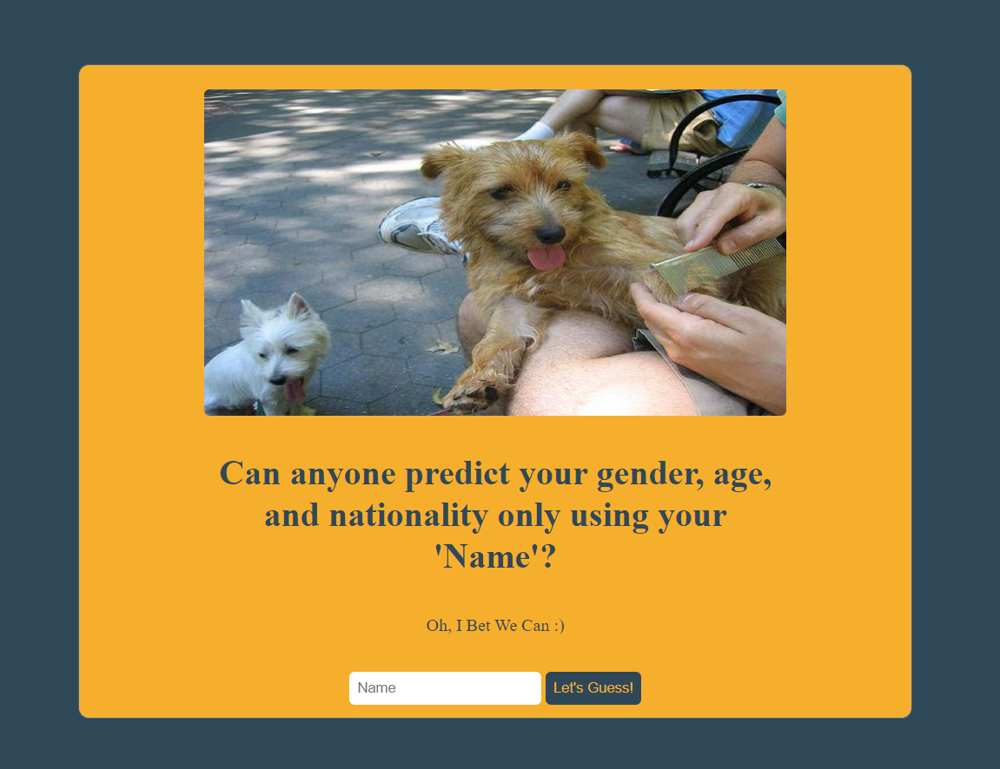
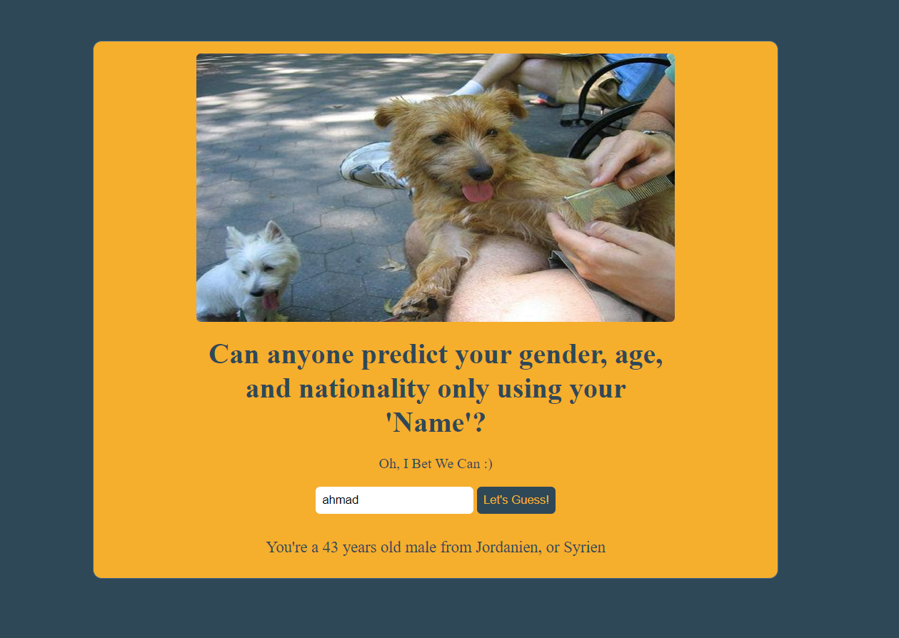

# prediction-frontend
A prediction frontend website that shows the guess the user gender, age and nationality based on his name only.

# Languages-used
HTML,CSS, JS

# Project Screenshots(Mockup):
When the website runs, this is the first thing will be shown:

Pressing on (Let's Guess button) and after validating the input the gender, age, and nationalities guesses will be displayed under that button directly:

# Public APIs
-Gender API: https://api.genderize.io/
-Age API: https://api.agify.io/
-Nationalities API: https://api.nationalize.io/
-Dog_image API: https://dog.ceo/api/breeds/image/random

# Installation and Setup Instructions
git clone https://github.com/mohammadammash/prediction-frontend.git

