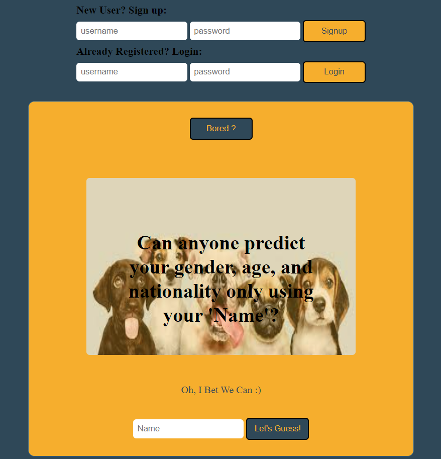
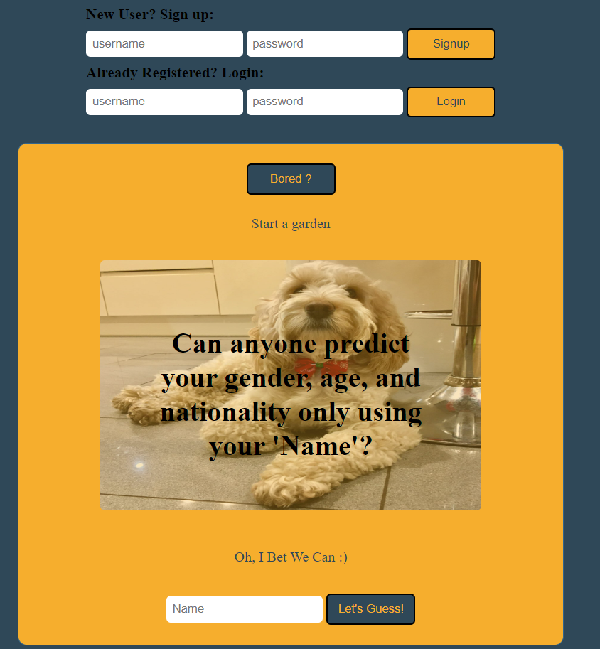

# prediction-frontend
A prediction frontend website that shows the guess the user gender, age and nationality based on his name only.

# Languages-used
HTML,CSS, JS

# Project Screenshots(Mockup):
When the website runs, this is the first page shown:

 
After pressing user register or login successfully, the ip address will be shown in the first page column in black:
 

 
After pressing the first column button in the yellow box(Bored ?), then a random activiy will appear to the user below the button:
 

 
When the user enters his own username in the username(input)-at the end of the yellow box- the guess results will appear below:
 

 
# Public APIs
-Gender API: https://api.genderize.io/
-Age API: https://api.agify.io/
-Nationalities API: https://api.nationalize.io/
-Dog_image API: https://dog.ceo/api/breeds/image/random

# Installation and Setup Instructions
git clone https://github.com/mohammadammash/prediction-frontend.git

# Reach me
Gmail: mohammadammash31@gmail.com
Github: https://github.com/mohammadammash
